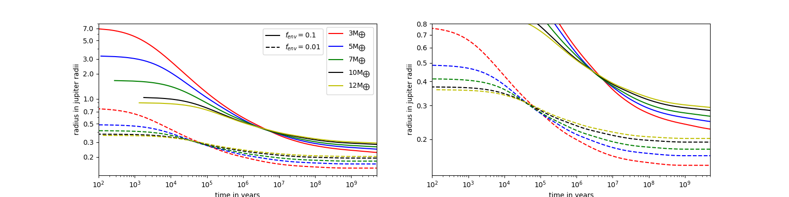
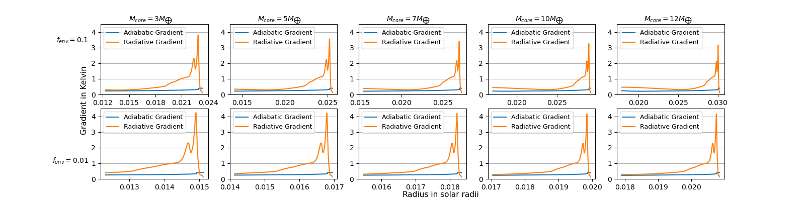
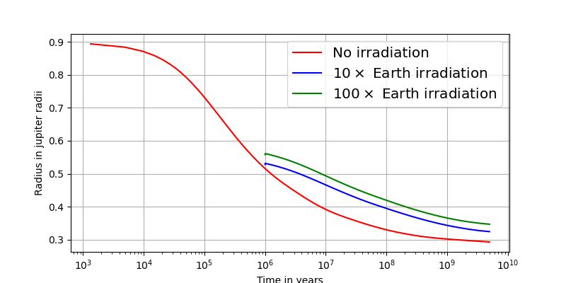

# Project on exoplanets

In this project we will create low mass planets with an envelope made mostly by H and He. We will simulate their interiors and evolution. For one of the planets we have created, we will also simulate how irradiatation from a central star affects its structure and evolution. We follow the work of [Chen & Rogers (2016)](https://iopscience.iop.org/article/10.3847/0004-637X/831/2/180). 

The project uses `MESA` which needs to be installed if you want to run the simulations. More information can be found [here](https://docs.mesastar.org/en/release-r23.05.1/). To run it use the folder `run_mesa` and follow the instructions of README inside the folder.

## Files
The project contains the following files:
- `visualization.ipynb`: notebook to create different plots based on the results of the simulations
- `catalog.csv`: catalog of exoplanets, obtained from [here](http://exoplanet.eu/)
- `report_1.pdf`: first report explaining the simulations and visualization plots.
- `report_2.pdf`: second report explaining the simulations and visualization plots.

## Visualization Plots
Here are 2 plots from the multiple that were produced in this project 

